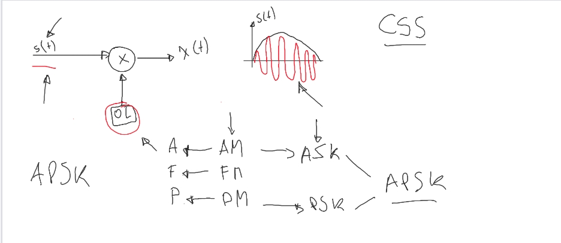
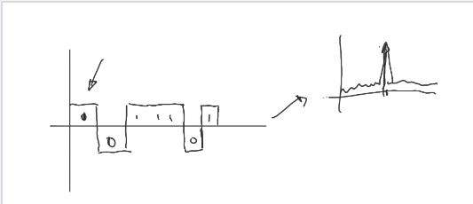
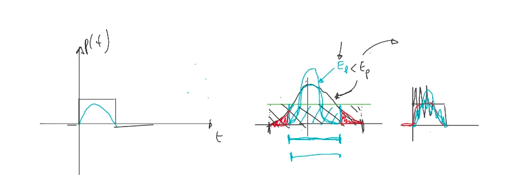
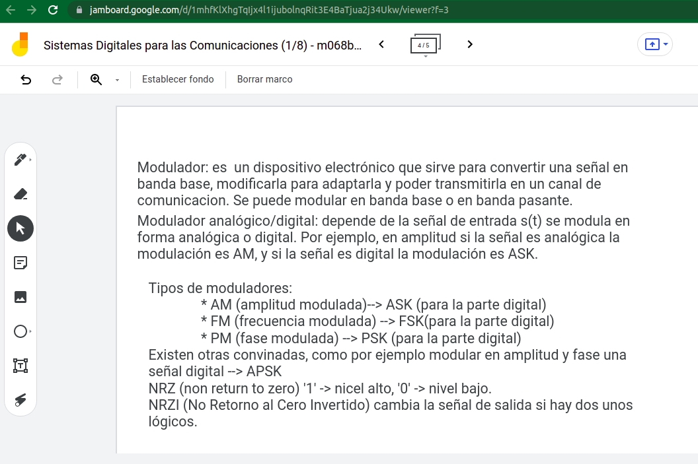

# Sistema Digitales para las Comunicaciones

Maestría en Sistemas Embebidos de la FIUBA

Autor: Pablo D. Folino

Profesor: Federico Zacchigna

Año: 2021

Historial
| Fecha | Descripción | 
| :-: | :-: |
[27/10] | Primer commit.| 
[27/10] | Modificación de las imágenes |

Repositirio: https://github.com/MSE-SDC/trabajos-practicos-PabloFolino

Capturas del  jamboard:

Definiciones:

