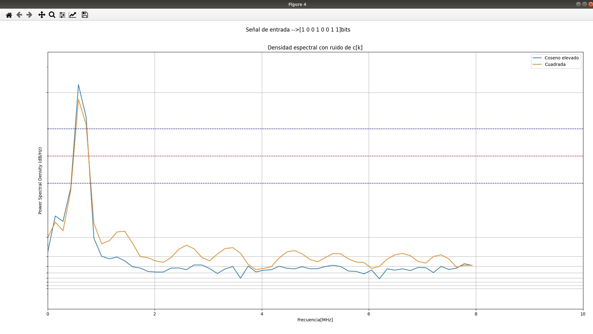

## Enunciado Trabajo Práctico 3

Simulación del modulador en banda base y el canal.
 
El sistema a desarrolar es el siguiente:

### Respuesta
1. El programa se generó en Python.
   Al iniciar el mismo aparece un menú en donde se pueden contestar las
   preguntas del ejercicio.
   

Cada vez que se accede a la opción [1] se genera un código de 8 bits 
aleatorio.

En la opción [2] se pueden elegir un tiempo de sampling 8 o 16 muestras. 

La opción [3] se usa para probar la función coseno elevado:

En este ítem también se muestra la convolución del coseno elevado con 
la señal de entrada.

En la opción [4] se realizó la prueba de la distribución Gaussiana, en 
la cual se pueden cambiar algunos parámetros como el sigma.

En la opción [5] se pueden observar las señales d[k], p[k], x[k], y c[k]
esta última con el ruido, para las 4 señales p[k] sugeridas en el 
enunciado:

En el ítem [6] se vuelen a mostrar las x[k] y los espectros, con y sin
ruido. Se observa que el coseno elevado posee el espectro más limpio.

 

En la opción [7] se hace una comparación del espectro del coseno elevado
y una onda cuadrada.
 

La última opción se utiliza para salir del programa.
 
