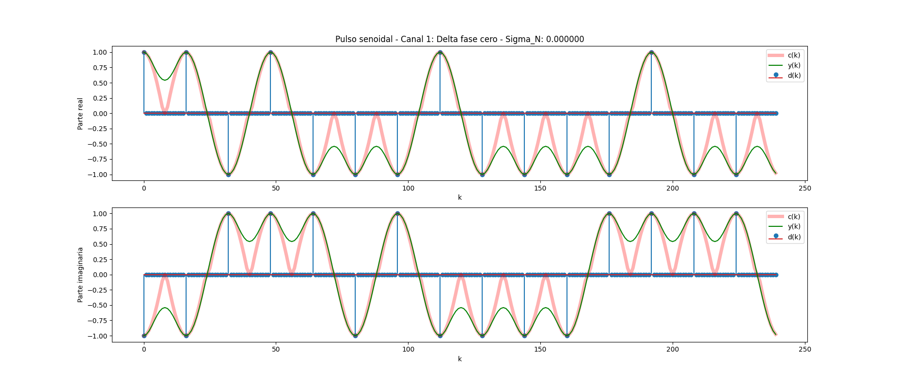
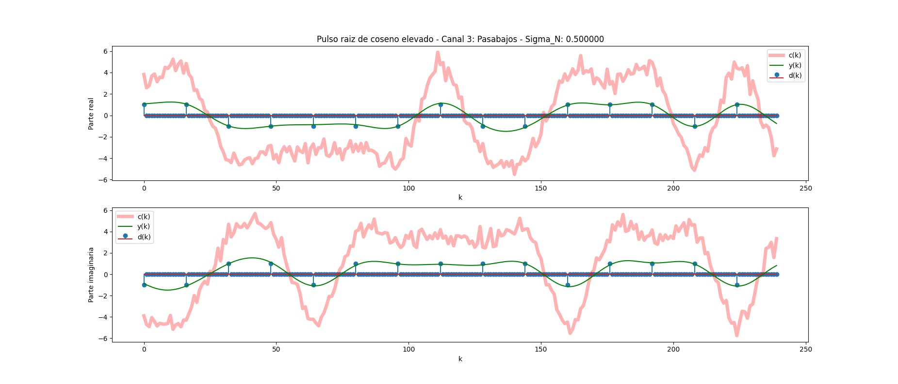
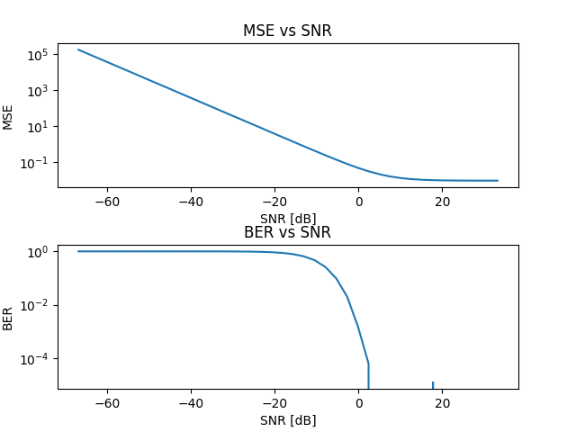

# Trabajo Práctico 5 - Galeria de imágenes

## Pulso rectangular

### Ruido: sigma=0.0

#### Constelación

### Ruido: sigma=0.5

#### Constelación

### Ruido: sigma=1.5

#### Constelación

## Pulso triangular

### Ruido: sigma=0.0

#### Constelación

### Ruido: sigma=0.5

#### Constelación

## Pulso senoidal

### Ruido: sigma=0.0

#### Constelación

### Ruido: sigma=0.5

#### Constelación

## Pulso raiz de coseno elevado

### Ruido: sigma=0.0

#### Constelación

### Ruido: sigma=0.5

#### Constelación

### Ruido: sigma=1.5

#### Constelación

## MSE vs SNR y BER vs SNR - Filtro rrcos

### Metodo 1

#### Canal ideal

#### Canal delta desfazada

#### Canal pasabajos

### Metodo 2

#### Canal ideal

#### Canal delta desfazada

#### Canal pasabajos
