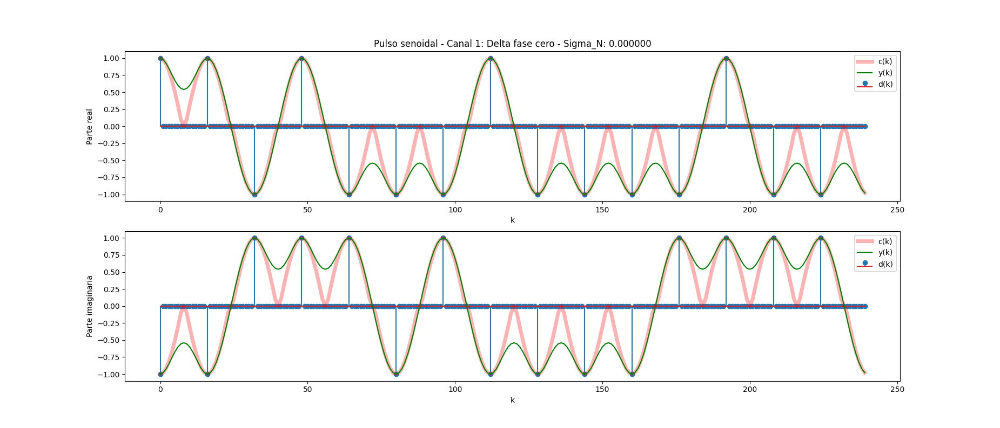
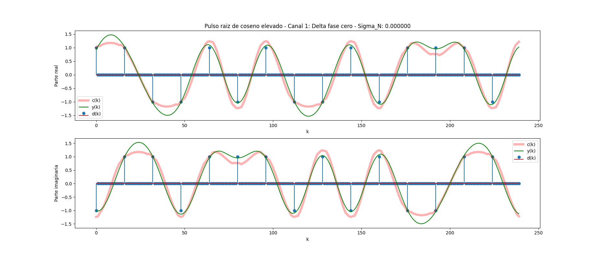
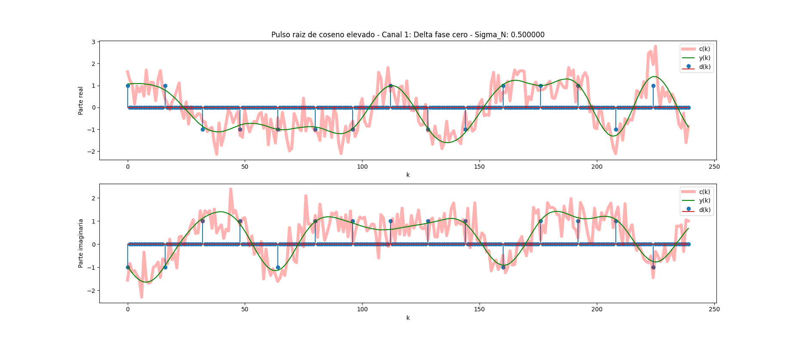
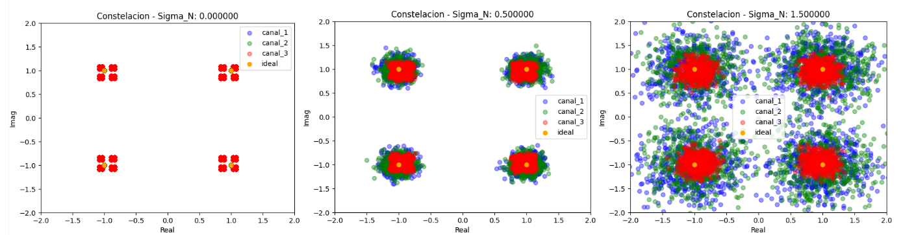
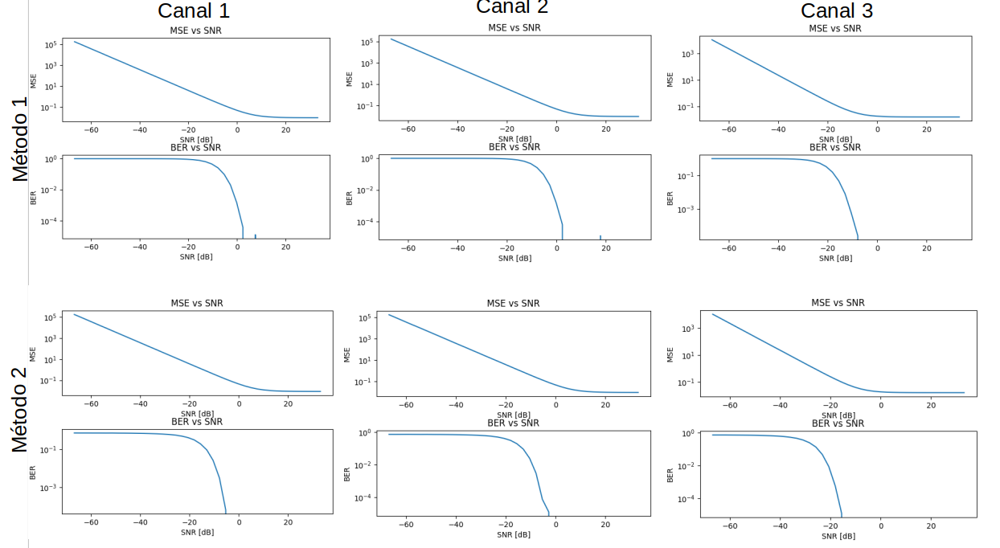

# Trabajo Práctico 5

## Punto 2

Para el pulso raíz de cosenos elevado elija una potencia de ruido y de manera similar al ejercicio 3, graficar las señales d, c e y (atención, y en vez de x) superpuestas en un mismo gráfico. Realice el gráfico para cada pulso del punto anterior. Verificar que las deltas coinciden con los picos de los pulsos, inclusive para el pulso raíz de coseno elevado. Realizarlo para el canal ideal.

- Utilizando el pulso senoidal, se muestra el caso de canal ideal y sin ruido:


    - La señal y se encuentra escalada para que la altura coincida con la de las deltas de la señal d. El escalamiento se realizó calculando el máximo de la convolución entre los filtros del modulador, del demodulador y del canal:

```
# Escalamiento: Se escala para cada canal
esc1 = np.max(np.convolve(p_dem, np.convolve(p_dem, h1)))
```

- Ahora utilizando el pulso raíz de coseno elevado, se muestra tambien el caso de canal ideal y sin ruido:


    - En este caso se puede observar que a pesar de la interferencia inter-símbolo, las deltas coinciden con los picos de la señal (luego del escalamiento).


- A medida que se agrega ruido al canal se puede ver como las deltas dejan de coincidir con los picos de la señal. A continuación se observa el caso de pulso de raíz de coseno elevado, canal ideal y ruido blanco de sigma = 0.5:


- En el archivo GALLERY.md se pueden observar las mismas imágenes para el resto de los pulsos y canales.


## Punto 3

Elija un pulso y dos potencias de ruido y para cada caso realizar un gráfico e las constelaciones. Incluir el símbolo sin ruido. Realizarlo para todos los canales.

#### Pulso rectangular


#### Pulso raíz de coseno elevado (RRCOS)


Se pueden hacer las siguientes observaciones:
- En ambos casos a medida que aumenta el ruido se puede observar como el error aumenta, la nube de puntos alrededor del símbolo sin ruido se hace más grande.
- En el caso del pulso rectangular, cuando la potencia del ruido es cero se ve claramente un patron en la grafica correspondiente al canal pasabajos (en rojo en la primera imagen), este patrón se debe a la interferencia inter-símbolo. 
- Para el caso del pulso RRCOS se observa un patrón distinto, debido a que este pulso agrega una interferencia inter-símbolo propia. Incluso aunque no se observa con claridad en la imagen, el canal ideal (azul) también presenta un patrón debido a la ISI.
- En todos los casos se puede observar que para el canal pasabajos la constelación se acerca levemente al origen, esto se debe a que la ganancia del filtro utilizado es distinta de 1. Esto se hace más evidente en el pulso rectangular debido a que este no aporta ISI.

## Punto 4

Realizar un gráfico de MSE y BER vs la relación señal a ruido, para ello:

1. Para las métricas considere:
  1. MSE: Error cuadrático medio `mean((b-hat_b)^2)`.
  1. BER: Bit-error rate `sum(b!=hat_b)/length(b)`.
1. Hay que variar la potencia de ruido, dejando la potencia de señal fija.
1. Calcular las energía y la potencia de la señal transmitida. Para esto considerar al pulso como una señal continua (no discreta), y calcular su energía como: $E_s = \int_{0}^{T_{\text{symb}}} |p(t)|^2 dt$ y finalmente obtener la potencia diviendo por el período $P_s = E_s/T_{\text{symb}}$.
1. La potencia de ruido es $P_n = \sigma^2 = N_0/2$.
1. La relación señal a ruido es $SNR = P_s/P_n$.

- El análisis se hizo únicamente para el pulso de raiz de coseno elevado.

- La potencia de la señal se calculo de la siguiente manera:
```
    # Para el calculo de la energia de la senal hay que considerar al pulso como continuo,
    # Una forma de aproximar esto es agregar muchos puntos aumentando la frecuencia de sampleo
    OVER_SAMPLING = 10
    t_p_c, p_rised = filters.rrcosfilter(OVER_SAMPLING*(L_FIR*4), 0.35, Ts, L_FIR*OVER_SAMPLING / Ts)
    p_rised = p_rised/np.max(p_rised)
    # Hago la integral 
    Es = np.sum(np.square(np.abs(p_rised))) * Ts / L_FIR / OVER_SAMPLING
    Ps = Es / ( (OVER_SAMPLING*(L_FIR*4)) * (Ts / L_FIR / OVER_SAMPLING) )
```

- Por otro lado la potencia del ruido y la SNR se calcularon así:
```
    # A sigma se le dieron valores de entre 10^-2 y 10^3
    n_i = np.random.normal(0,sigma,len(c))
    n_q = np.random.normal(0,sigma,len(c))
    n = n_i + n_q*(1j) # Ruido del canal
    Pn = sigma*sigma
    # Se creó un vector para la SNR de forma de almacenar la SNR para cada potencia de ruido
    snr[idx] = 10*np.log10(Ps/Pn)
```

- Para el calculo de MSE no hubo mayores incovenientes y se realizó de la siguiente manera:
```
    mse[idx] = np.mean(np.square(abs(b - hat_b)))
```

- Para el calculo de BER se probaron dos métodos distintos:
  - Por un lado se utilizó la función de numpy "rint", la cual redondea un número al entero más cercano. El problema con esta función es que creo que no realiza correctamente la detección ya que, por ejemplo, si un símbolo pose valor real b_i=0.4, al hacer np.rint(b_i) va a dar 0 y el símbolo no será detectado correctamete. Pero en realidad b_i=0.4 está considerablemente más cerca de 1 que de -1, y podría ser detectado.

```
    # Method 1
    hat_b_i = np.rint(np.real(hat_b))
    hat_b_q = np.rint(np.imag(hat_b))
```

  - Para evitar este inconveniente se probó un segundo método donde únicamente se evalúa el signo de símbolo y de esta manera se obtuvo un mejor BER:  

```
    # Method 2
    hat_b_i = np.zeros(N)
    hat_b_q = np.zeros(N)
    for i in range(N):
        if (np.real(hat_b[i]) > 0):
            hat_b_i[i] = 1
        else:
            hat_b_i[i] = -1        
        if (np.imag(hat_b[i]) > 0):
            hat_b_q[i] = 1
        else:
            hat_b_q[i] = -1
```

  - En ambos casos una vez calculados hat_b_i y hat_b_q, el BER se calculó como:

```
    err_count = 0
    for j in range(len(b)):
        if (b_i[j]!=hat_b_i[j] or b_q[j]!=hat_b_q[j]):
            err_count = err_count + 1
    ber[idx] = err_count / len(b)
```

  - En la siguiente imagen se muestran los resultados de ambos métodos para los 3 canales:



- Con el primer método se obtuvo un BER máximo prácticamente igual a 1, mientras que con el segundo método el BER máximo es de 0.75, lo cual creo que tiene más de sentido teórico ya que siendo 4 los símbolos posibles en el peor de los casos el error es de $BER_{max}=1-\frac{1}{4}=0.75$.