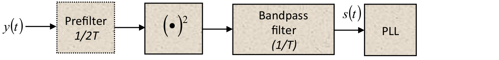

## Enunciado Trabajo Práctico 6

Simulación (demostrativa) del sistema completo incluyendo sincronización.

### Objetivo

Familiarizarse con las dificultades que existen para la sincronización
de símbolo.
Conocer el método de recuperación de reloj utilizando PLL.

El docente explica el siguiente diagrama en blouqes, y se centra en el funcionamiento del PLL(Phase Locked Loop).
PLL es un oscilador controlado por tensión,y se utiliza para sincronizar los datos recibidos por el canal de comunicación.

Explica varios sripts que demuestran el funcionamiento del PLL.

Haciendo sus simulaciones:

Se analiza la señal del canal, y se observa el preámbulo, que es en donde se sincroniza el PLL.

Se observa que entre una trama y otra el canal no posee señal. 

En la siguiente figura se observa que en los círculos rojos es en donde se singroniza la frecuencia del PLL(preámbulo de la señal), y
en los óvalos azules es endonde la frecuencia del PLL permaneca más o menos constante. En la parte azul
es en donde se encuentran los datos del canal.

En el preámbulo se observa (en el siguiente gráfico), la señal azul es la original, en rojo es la elevada al cuadrado, y
en amerillo es la señal rojo filtrada, con eso se puede obtener un nivel de señal para saber cuando hay datos en el canal o no.

Al final se hace un raconto del PLL, explicándolo con el siguiente gráfico.

