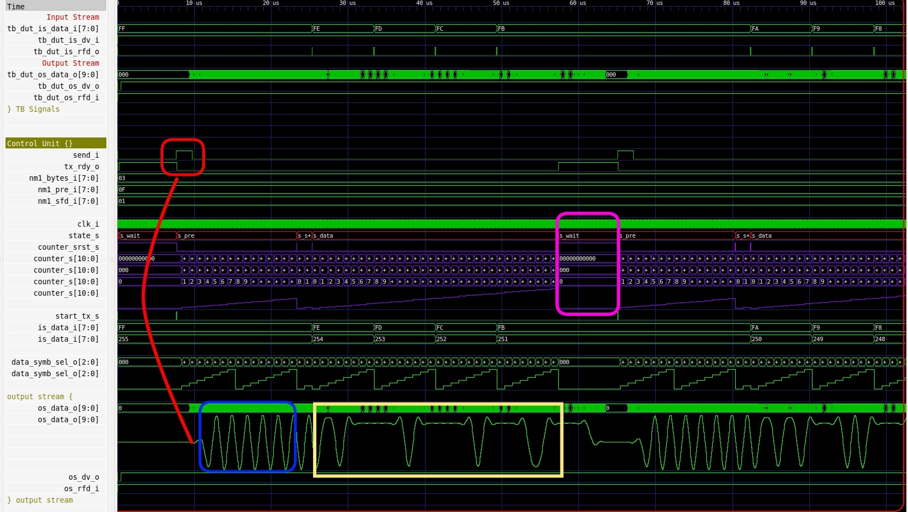
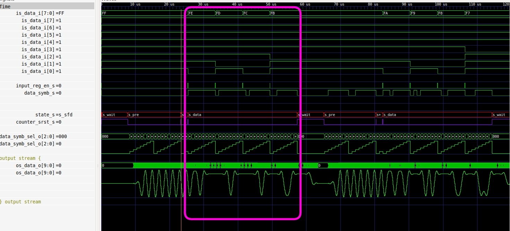

## Enunciado Trabajo Práctico 7

Simulación del código RTL del modulador:

### Objetivo

Familiarizarse con la simulación de código RTL en el repositorio
y el bloque del modulador.

### Respuestas
En la siguiente figura:

Se observa lo siguiente:

En un recuadro rojo las señales send_i y tx_rdy_o que inicializan una 
trama.
En el recuadro azul(salida), se observa el preámbulo de la trama,a 
continuación del mismo los dos símbolos del delimitador, y porsteriormente
(en un recuadro amarillo) están los datos. En el recuadro rosa se 
remarca el tiempo entre tramas.

En la siguiente figura(en el reguadro rosa), se observa en al entrada la
adquisición de los datos, y cómo se relaciona con la salida.

En la siguiente figura se marca con líneas rojas los flancos en donde se muestran los datos de entrada y cómo se relacionan con la salida.   

## Detalle de algunas señales:

is_data_i --> Dato de entrada al modulador

-- Señales de salida del filtro FIR:

    os_data_o   --> Salida de la señal   
    os_dv_o  	=> tb_dut_os_dv_o,    
    os_rfd_i   	=> tb_dut_os_rfd_i, 
    
    
-- Control and report IOs

send_i 	 --> indica cuando comienza una transmisión

tx_rdy_o --> undica cuando el moden está listo para transmitir
			 con esta entrada en 1 y un fanco asce en send_i comienza a
			 Tx(transamitir)

nm1_bytes_i  --> cantidad de bytes a transmitir. Ej: si pongo 7 indico 
				 que voy a Tx 8 Bytes. En el ejemplo de la simulación 
				 es 3.
				 
nm1_pre_i    --> cantidad de símbolos que se envía en el preámbulo. Para
				  el ejemplo es 15 símbolos.
				  
nm1_sfd_i    --> cantidad de bits del delimitrador de tramas. Para el 
				  ejemplo es 1.
