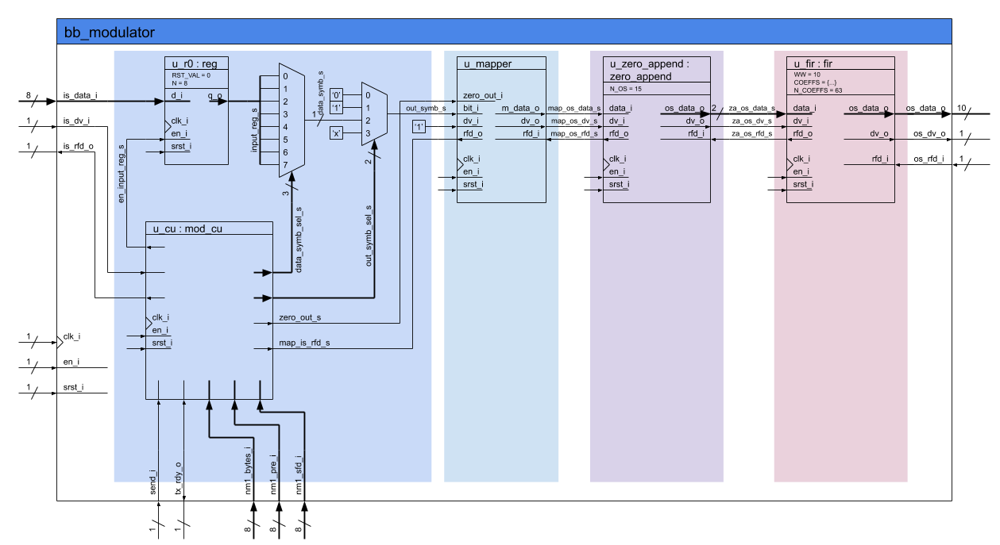
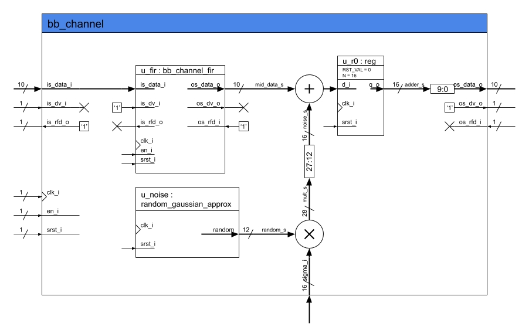
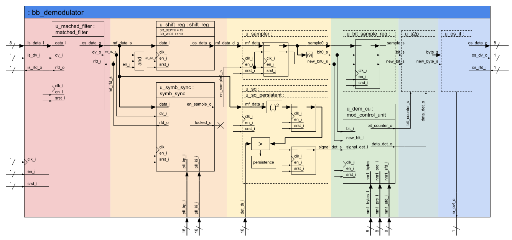
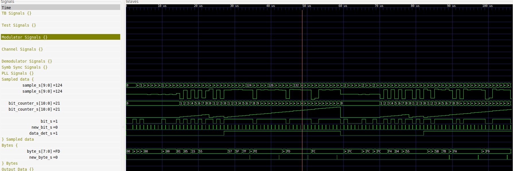
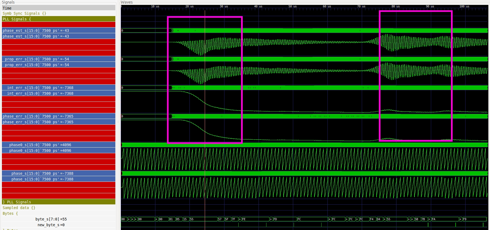

## Enunciado Trabajo Práctico 9

Simulación del código RTL del modem y el canal.

### Objetivo

Familiarizarse con bloque del demodulador y el bloque del modem
que incluye tanto al modulador como al demodulador.

### Diagramas en bloque

### Respuesta

1. Se genera el test-bench "tb_test_modem_channel.vhd"

2. En el testbench "tb_test_modem_channel.vhd" se instancia el "test_modem_channel.vhd", y en este último se instancia el modem, y el canal.

3. Se debe simular el modulador y el canal escribiendo-->  "make tb_test_modem_channel".
    
4. Se deben buscar y visualizar todas las señales de interés en la simulación:
.
    
Seguidamente se observan las señales del modulador(entradas,configuración y de salida).

 
   

   
   
En el canal, se observan la señal de entrada(sin ruido), las de control, y las de salida(con ruido). 
   

   
 En el siguiente gráfico s eobsevan las señales del demodulador(entrada con ruido, salida del filtro,subsampleada, la salida estimada en binario, y señales de config-control).
   

   
A conftinuación se muestran las señales de sincronización , en el recuadro rosa se observa en donde hay mayor error y es endondo comienza a sincronizarse.
Cuando aparecen los datos(entre los dos recuadros rosas), se observa que el pll está bastante sincronizado.

