# Enunciado Trabajo Práctico 10

Simulación del código RTL del sistema completo.

## Objetivo

Familiarizarse con sistema completo, incluyendo:
- Modem
- Emulador d canal
- Unidad de control
- FIFOs
- UART

## Descripción general

A continuación se muestra el diagrama en bloques general:

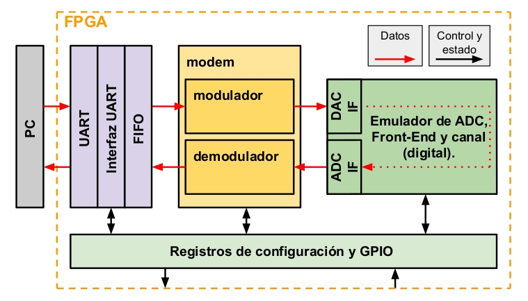

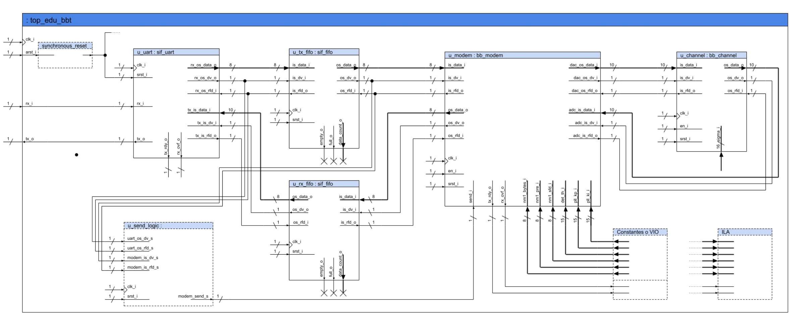

Las características del sistema son:
Modulación 2_PAM en banda base, sin codificación de línea,frecuencia de 
símbolo de 1MHz y frecuencia de sampleo de 16MHz.
Tipo de pulso es raiz de coseno elevado, con energía constante unitaria.

El sistema se conecta por una UART a 115200 baudios tanto como para transmitir 
como para recibir, sin paridad, con 8 bits de datos y un bit de stop.

**Importante**: el bloque **u_send_logic**, lleva el control de la cantidad de datos(8 bits)que hay en el bloque **u_tx_fifo**.
Si hay más de 4 datos habilita la señal **send_i** del bloque del **u_modem**, así comienza a transmitir. 
Este bloque se da cuenta cuantos datos entran o salen de la **fifo** mediante dos línea de en trada y dos líneas de salida  llamada **dv** y **rfd**.
Cuando ambas líneas están en uno, significa que entró o salió un dato.

  
### El moden está compuesto por dos bloques(modulador y el demodulador):

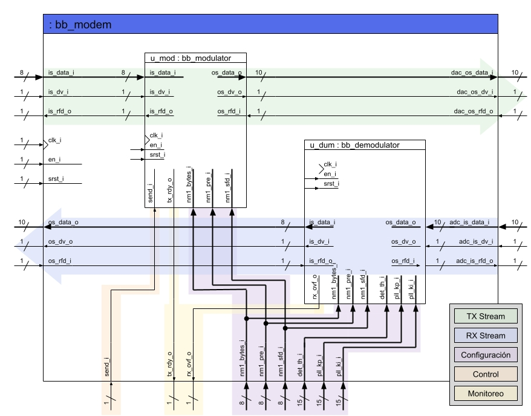

Las señales que controlan al moden provinen del bloque de "**Registros de 
configuración y GPIO**", en realidad este bloque esta compuestos por los bloques "**Constantes o VIO**" y "**u_send_logic**". 

+ La transmisión es asindrónica con un preámbulo de sincronización(setado en **nm1_pre_i=07**) 
y delimitador de trama(seteado para cuatro bits --> **nm1_sfd_i=3**) configurable.

+ Para poder transmitir se tiene que tener una cierta cantidad de bytes, 
esa cantidad se puede configurar, en la actualidad está configurado 
para 4 bytes(**nm1_bytes_i=3**).

+ La señal **send_i**, indica cuando comienza una transmisión.

+ La señal **tx_rdy_o**, indica cuando el moden está listo para transmitir
con esta entrada en 1 y un flanco ascente en  send_i comienza a Tx(transamitir).

### El canal se conecta con el modem mediante dos interfaces(conversores **ADC** y **DAC**) 

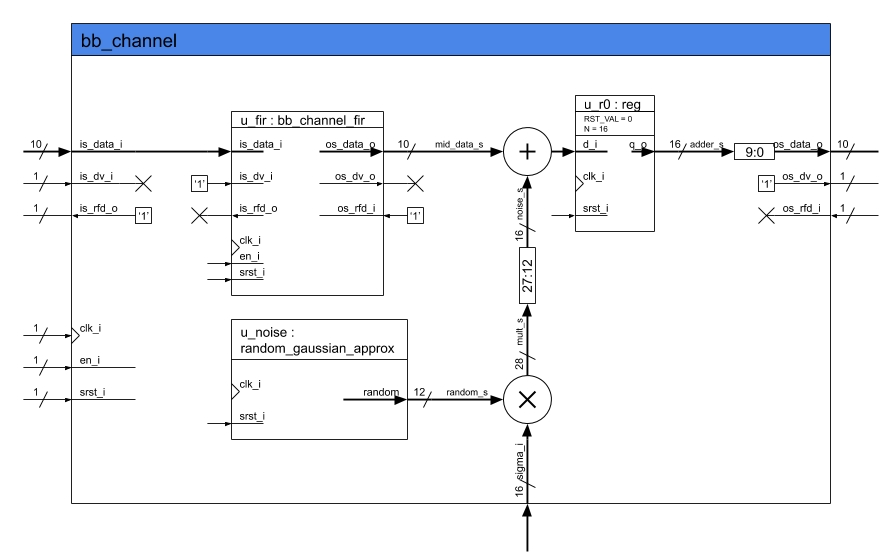

+ Ambas interfaces con 10bits de datos en formato **Q10.8**, con indicación de ***underflow*** y ***overflow***.
+ El **ADC** y el **DAC** poseen un clock común.
+ El canal simula un ruido blanco aproximadamente Gaussiano configurable 
mediante la variable **sigma_i**.
+ La respuesta en frecuencia está implementada mediante un FIR de largo 
configurable.

## Descripción de cada bloque

### **synchronous_reset y u_uart**

En la siguiente simulación se muestra el funcionamiento del reset sincrónico(**srst_i**) a la entrada de la UART. Se observa que trabaja con flanco ascendente de la señal de clock.
Al resetarse pone la salida(**rx_os_data_o**) a a cero.
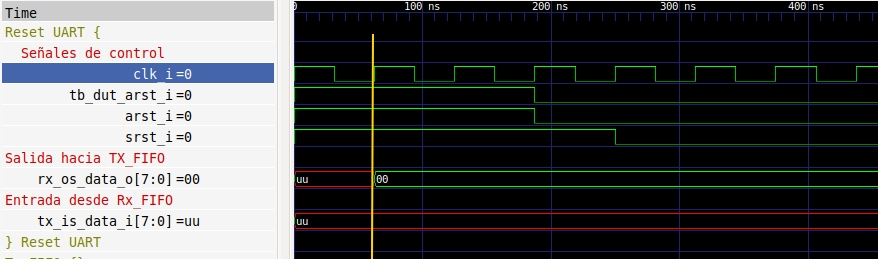

En la siguiente captura se muestran los datos que van hacia la **u_tx_fifo**, que terminan pasando por el canal y vienen de la **u_rx_fifo** de regreso, se observa que luego de un tiempo los datos son los mismos(o sea no hay pérdida de información).
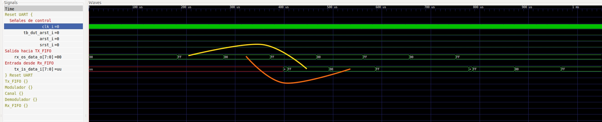

### **u_tx_fifo**
En la siguiente captura se muestra como se incrementa el contador(flechas naranjas) a  medida que llegan los datos.
En el recuadro amarillo es en el instante que los datos salen hacia el modulador por **os_data_o** y el contador decrementa.
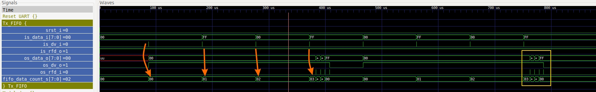
A continuación se amplifica el recuadro amarillo para que se observe con más detalle:
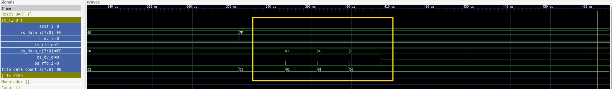

### **u_modem**

#### Modulador

La siguiente captura muestra por un lado las señales de control que configuran al modulador como **nm1_pre_i=7**, **nm1_sfd_i=3** y **nm1_bytes_i=3**.
Se está diciendo que el preámbulo es de 8 bits que se verifica(línea roja de tiempo), el delimitador  de trama es de 4 bits(línea verde de tiempo), y la cantidad de bytes a transmiter es de 4(línea rosa de tiempo).
Por otro lado se remarca con un círculo naranja el pulso de **send_i**, que da comiezo a la transmisión, y en los círculos azules son en los instamtes en donde se cargan los 4 bytes a transmitir.
Por supuesto la señal en amarilo  (**dac_os_data_o**) es la señal que se transmite al canal.
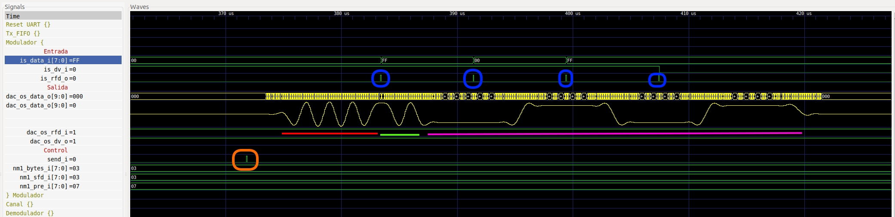

#### Demodulador

Se muestran la señal de entrada al demodulador que es la misma que la salida del modulador, pero con un ruido seudo Gaussiano.
La variación de fase del PLL, se observa que al comienzo(en el preámbulo de la señal de entrada) varía mucho y luego permaneca aprox. contante.
Y en la línea **os_data_o** es la salida digital que se envía al **u_rx_fifo**.
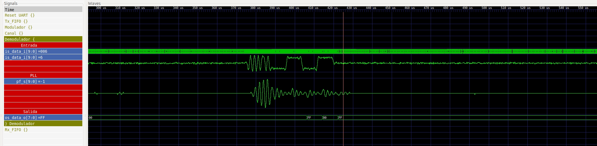

### **u_rx_fifo**

Tiene un funcionamiento análogo al módulo  **u_tx_fifo**.
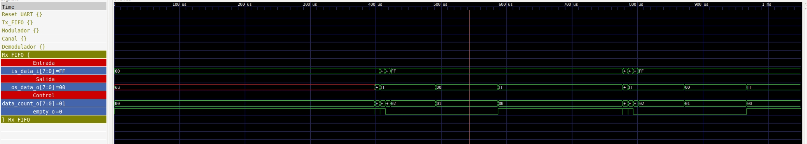

### **u_channel**
Simula el canal de comunicación y agrega un ruido semi Gaussiano. En amarillo es la señal que viene del modulador y en naranja es la señal que  se inyecta al demodulador.
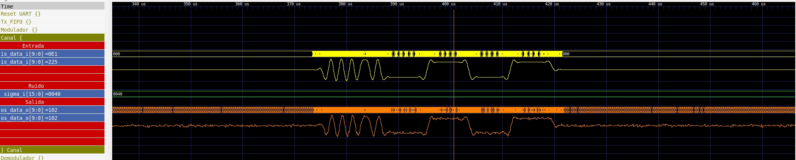

